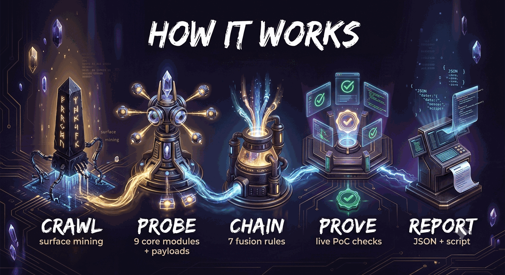

<div align="center">

# ⚡ VEXOR

**V**ulnerability **EX**ploit & **OR**chestration

*An autonomous web exploitation engine that discovers real vulnerabilities, chains them into critical attack paths, and proves every finding with reproducible evidence.*

[](https://golang.org)
[](https://github.com/0xamirdev/vexor/releases)
[](https://github.com/0xamirdev/vexor)
[](LICENSE)
[](https://github.com/0xamirdev/vexor/stargazers)

[Report a Bug](../../issues) · [Feature Request](../../issues) · [Security Policy](SECURITY.md)

</div>

---

> ⚠️ **Authorized Use Only.** VEXOR is built exclusively for penetration testers, security researchers, and bug bounty hunters operating within explicit written permission. Testing systems without authorization is illegal in nearly every jurisdiction. The authors accept no liability for misuse.

---

## Why VEXOR Exists

Traditional scanners share a fundamental weakness: they report *matches*, not *impact*. A reflected parameter means nothing on its own — a scanner that stops there wastes your triage time.

VEXOR takes a different approach borrowed from real-world red teaming. It explores a target with **zero path assumptions**, identifies every injectable surface, verifies each vulnerability with live evidence rather than passive pattern matching, and then — this is the part that matters — **fuses individual findings into composite attack chains** that a triager can act on immediately.

A reflected XSS plus a session cookie without HttpOnly is not two low findings. It is an account takeover. VEXOR understands this.

## How It Works

<p align="center">
  
</p>

### Discovery Without Assumptions

The crawler never touches a static wordlist. It mines links, forms (GET and POST), query parameters, JSON API keys, and script sources from live responses, then quietly probes well-known sensitive locations. Every URL it touches becomes raw material for the probe stage.

### Nine Probe Modules

| Module | Techniques | Level |
|---|---|---|
| **SQLi** | Error-based fingerprints across five database engines, boolean-based differential analysis using response similarity scoring, UNION column-count discovery | Parameter |
| **XSS** | Unique-canary reflection detection, HTML context classification (attribute / script-string / body), context-matched event-handler escalation | Parameter |
| **CMDi** | Echo-based arithmetic markers and time-based blind detection across eight shell syntaxes | Parameter |
| **SSTI** | Arithmetic fingerprints for Jinja2, Twig, Freemarker, Velocity, Pebble, and Smarty | Parameter |
| **LFI** | Traversal variants, filter-evasion encodings, PHP wrapper abuse, Windows targets | Parameter |
| **SSRF** | Loopback and cloud-metadata fetches with reflection-versus-fetch discrimination to eliminate false positives | Parameter |
| **Redirect** | Location-header and client-side redirect primitives tested against ten bypass vectors | Parameter |
| **Misconfig** | CORS origin reflection, missing security headers, exposed directory listings | Endpoint |
| **Exposure** | Credential patterns (AWS, GitHub, Stripe, JWT, private keys), sensitive file exposure, verbose debug output — every secret finding passes an impact-verification tier: **verified** (token replayed and accepted), **potential** (pattern matched, impact unproven, capped at medium), or **public-by-design** (client SDK config, informational) | Endpoint / Host |

### Vulnerability Fusion

This is where VEXOR departs from every conventional scanner. The chain engine looks for *combinations* and verifies them:

| Chain | Result |
|---|---|
| XSS + session cookies without HttpOnly/Secure | **Account Takeover** |
| SQLi on an authentication parameter | **Authentication Bypass** |
| SSRF + exposed configuration endpoints | **Cloud Credential Theft** |
| LFI reaching log or session files | **Pre-Auth RCE Path** (verified live) |
| CORS reflection + same-origin XSS | **Cross-Origin Data Exfiltration** |
| Open redirect on an OAuth flow | **Authorization Code Theft** |
| Confirmed SSTI | **Remote Code Execution Path** |

### Proof, Not Guesses

Every finding ships with the exact payload, a `curl` command that reproduces it, and where applicable a live verification: extracted database version, read host files, echoed shell markers. The PoC replay script generated at the end of each run re-executes every finding automatically — ready to attach to a bug bounty report.

Severity is never assigned on pattern matching alone. A finding either demonstrates impact, or it is explicitly labeled **Potential (unverified)** and capped below high. Client-side SDK tokens (chat-widget `websiteToken`s, publishable keys, site keys) are public by design and are reported as informational noise-avoidance, never as HIGH secrets.

## Verification Tiers

| Tier | Meaning | Severity |
|---|---|---|
| **Verified** | VEXOR replayed the token and the server accepted it, or extracted live data | Full severity, replay PoC included |
| **Potential (unverified)** | Sensitive-looking pattern, impact unproven | Capped at medium, no exploit PoC |
| **Public by design** | Client-side SDK configuration sent to every visitor | Informational |

This model was built after a real-world false positive: a chat widget's `websiteToken` on a public login page was originally reported as a HIGH "secret leakage". It is now correctly classified as public client-side configuration.

## Acceptance Testing

VEXOR ships a black-box regression suite that boots a deliberately vulnerable server and asserts the reporting contract — including the exact false-positive scenarios above:

```bash
python3 tests/acceptance.py
```

## Installation

**Requirements:** none for the scripted install (Go is only needed for the source path). VEXOR installs as a real system CLI — once installed, `vexor` works from **any directory**.

### One-line install (recommended)

```bash
sh -c "$(curl -fsSL https://raw.githubusercontent.com/0xamirdev/vexor/main/scripts/install.sh)"
```

The installer detects your OS and CPU, downloads a **prebuilt binary** from GitHub Releases (no Go needed), places it in the first writable bin directory on your PATH (`~/.local/bin` on a typical Linux user account, Termux `usr/bin` on Android), wires your PATH, and verifies the result. If no prebuilt binary matches, it falls back to building from source with `go install` — installing Go first via `apt` (Debian/Ubuntu) or `pkg` (Termux).

### Termux

```bash
sh -c "$(curl -fsSL https://raw.githubusercontent.com/0xamirdev/vexor/main/scripts/install.sh)"
```

The same installer handles Termux: it installs `golang` via `pkg` when needed and targets the Termux `usr/bin`.

### Debian / Ubuntu

```bash
sh -c "$(curl -fsSL https://raw.githubusercontent.com/0xamirdev/vexor/main/scripts/install.sh)"
```

or with Go already present:

```bash
go install github.com/0xamirdev/vexor/cmd/vexor@latest
export PATH="$PATH:$(go env GOPATH)/bin"   # persist in ~/.profile
```

### Prebuilt binaries (manual)

Download directly from [Releases](https://github.com/0xamirdev/vexor/releases) — static binaries for `linux/amd64`, `linux/arm64`, `darwin/amd64`, `darwin/arm64`:

```bash
curl -fLo vexor https://github.com/0xamirdev/vexor/releases/latest/download/vexor-linux-amd64
chmod +x vexor && sudo mv vexor /usr/local/bin/
```

### Developers (inside the repository)

```bash
git clone https://github.com/0xamirdev/vexor.git
cd vexor
go build -o vexor ./cmd/vexor   # local binary: ./vexor
make install                    # or install it system-wide
```

### Verify (the contract)

```bash
cd /tmp
vexor --version                 # VEXOR 1.1.2 — works from ANY directory
```

The install contract is enforced in CI by `tests/install_clean_env.py`, which simulates a brand-new user (synthetic HOME, minimal PATH, empty profiles) and verifies the full flow. VEXOR also checks GitHub Releases at startup (3-second budget, fully silent offline) and warns when a newer version exists — without ever blocking or interrupting a scan.

## Quick Start

```bash
# Full pipeline scan
vexor -u https://target.example.com

# Aggressive scan with authentication and a custom out-of-band domain
vexor -u https://target.example.com -t 16 -H "Cookie: session=your_cookie" -marker oob.yourdomain.com
```

### Command-Line Reference

| Flag | Description | Default |
|---|---|---|
| `-u` | Target URL — the only required flag | — |
| `-t` | Concurrent worker threads | `8` |
| `-timeout` | Per-request timeout in seconds | `15` |
| `-p` | Maximum pages to crawl | `40` |
| `-marker` | Marker domain used in redirect and CORS probes. Point this at a host you control | `vexor.probe.invalid` |
| `-o` | Output directory for reports | `vexor-out` |
| `-H` | Extra request headers, comma-separated `Name: value` pairs — use for authenticated scans | — |
| `--version` | Print the VEXOR version and exit | — |

### Sample Output

```
 [1;31mcritical XSS + Weak Cookie Flags -> Account Takeover[0m
   ID       : VXR-7497962C
   Endpoint : GET http://target.example.com/greet
   Param    : name
   Payload  : <svg onload=alert('VEXOR')>
   Evidence : 1 session cookie(s) issued without HttpOnly+Secure
   PoC      : curl -sk 'http://target.example.com/greet?name=%3Csvg+onload%3D...'

 [1;31mcritical SQL Injection (Error-Based) - MySQL[0m
   ID       : VXR-C44BD072
   Endpoint : GET http://target.example.com/item
   Param    : id
   Payload  : '
   Evidence : You have an error in your SQL syntax ... near ''' at line 1
```

Exit code is `1` when findings exist and `0` when the target is clean, so VEXOR drops straight into CI/CD pipelines.

## Output Artifacts

| File | Purpose |
|---|---|
| `vexor_<target>_<timestamp>.json` | Machine-readable report with every finding, PoC URL, and exploit proof |
| `vexor_poc_<target>_<timestamp>.sh` | Executable script that replays every PoC end to end |
| Console | Color-coded findings ranked by severity with evidence and reproduction commands |

## Project Structure

```
vexor/
├── cmd/vexor/          CLI entry point
├── internal/
│   ├── banner/         UI rendering
│   ├── httpc/          HTTP client — redirect control, cookie persistence, timing
│   ├── crawler/        attack-surface discovery, zero path assumptions
│   ├── detect/         nine probe modules and evidence types
│   ├── chain/          vulnerability fusion engine
│   ├── exploit/        safe proof-of-concept generation
│   ├── engine/         pipeline orchestration and worker pool
│   ├── version/        central release version
│   └── report/         console, JSON, and PoC-script reports
├── tests/              acceptance suite (Python) + vulnerable test server
├── CHANGELOG.md
└── LICENSE
```

## Design Principles

- **Evidence over matches.** Nothing is reported without a concrete, reproducible artifact.
- **Zero dependencies.** Pure standard library. The entire toolchain builds with `go build` alone.
- **Safe by default.** Exploit routines are read-only and non-destructive — data reads, echo markers, fingerprint checks. Nothing is written, deleted, or denied.
- **Concurrency-first.** A bounded worker pool drives every probe stage, with race-safe result aggregation.
- **Deterministic IDs.** Findings are hash-addressed (`VXR-XXXXXXXX`), which makes deduplication and cross-run diffing trivial.

## Roadmap

- [ ] Out-of-band DNS callback integration for blind SSRF and XXE
- [ ] Stored XSS detection through crawler state persistence
- [ ] GraphQL schema introspection module
- [ ] HTTP/2 and request smuggling probes
- [ ] SARIF output format for GitHub Code Scanning integration

## Contributing

Contributions are welcome — new probe modules, chain rules, and performance work are all valuable. Read [CONTRIBUTING.md](CONTRIBUTING.md) to get started, and please follow the security policy for responsible disclosure.

## Support the Project

VEXOR is free and open source, built in spare time between engagements. If it helped you land a bounty or secure a system, consider supporting continued development.

<p align="center">
  <a href="https://0xamirdev.github.io/vexor/donate.html">
    
  </a>
</p>

**EVM / Ethereum wallet:**

```
0x75a727b8eb0e08e5cf184e102aa7f28497127e1b
```

The donate button opens an interactive donation page with a scannable wallet QR and one-click address copy — available on every EVM network: Ethereum, BSC, Polygon, Arbitrum, Base, Optimism.

## License

Released under the [MIT License](LICENSE).
